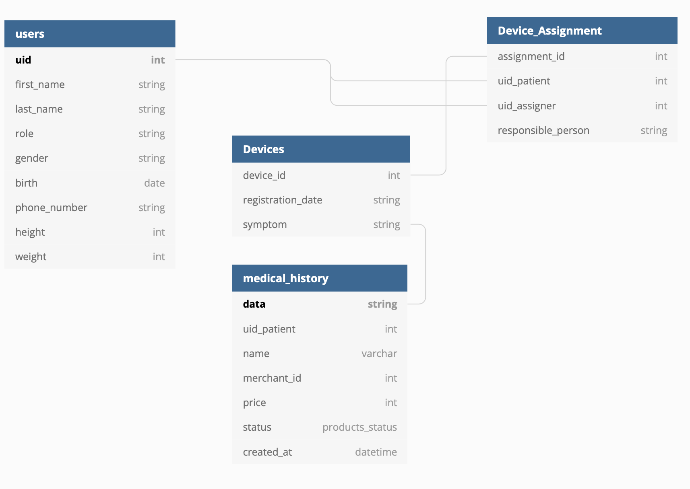

# Project2: Patient Care API

## Overview
Implement a healthcare application one module at a time.  My branching strategy is to develop modules (i.e. device modules) in separate branches, and once these modules have been tested, they will be merged with the main branch. The final project will be completed in the main branch.

## Module
In this module, the task is to define an interface, the patient application of equipment can be through the interface to the data of intake system 
The received data is checked for any errors and pushed to the data management module for storage in the master database.

## User Story
Administrator:

Add users to the system

Assign and change roles of users

Provide interfaces for third-party medical device manufacturers (thermometers, pulse, blood pressure, glucometers, etc.) to allow their devices to provide data to the system 

Ability to disable or enable any device manufacturer or application developer

Medical Professional:

Browse the patients 

Assign medical equipment to patients

Enter medical data for patients
Chat with patients
View reserved appointments

## Device Module
### Database schema
